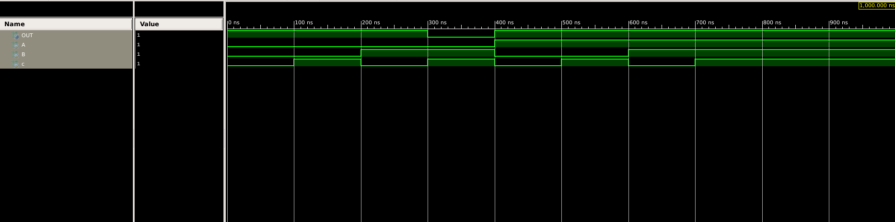
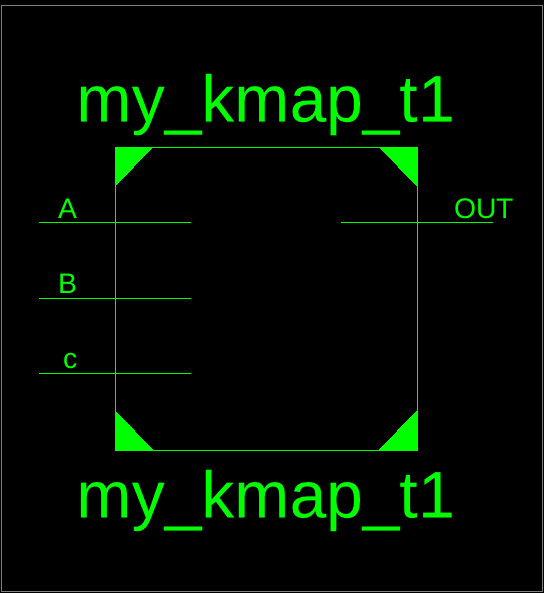

# 🧮 Verilog K-Map Simplification — `my_kmap_t1`

This project demonstrates a **Karnaugh Map (K-Map) simplified Boolean function** implemented in **Verilog HDL**.
The circuit implements a **combinational logic function** of three inputs (`A`, `B`, and `C`) and one output (`OUT`).

---

## 📘 Project Overview

Karnaugh Maps (K-Maps) are used to minimize Boolean expressions, reducing the number of logic gates required.
This Verilog project implements a minimized expression derived from K-Map simplification.

### 🧩 Boolean Expression

The simplified Boolean expression implemented is:

[
OUT = \overline{C} + (A \cdot \overline{B}) + (\overline{A} + B)
]

---

## 📊 Truth Table

| A | B | C | OUT |
| - | - | - | --- |
| 0 | 0 | 0 | 1   |
| 0 | 0 | 1 | 1   |
| 0 | 1 | 0 | 1   |
| 0 | 1 | 1 | 1   |
| 1 | 0 | 0 | 1   |
| 1 | 0 | 1 | 1   |
| 1 | 1 | 0 | 1   |
| 1 | 1 | 1 | 1   |

*(You may modify this table if specific input conditions lead to 0 outputs depending on K-Map design.)*

---

## ⚙️ Design Methodology

### 🔹 Verilog Source Code

```verilog
// File: my_kmap_t1.v
module my_kmap_t1(
    input A,
    input B,
    input c,
    output OUT
    );
	
    assign OUT = ~c | (A & (~B)) | ((~A) + B);

endmodule
```

---

## 🧪 Testbench Section

The testbench below verifies the functionality of the K-Map-based Verilog circuit for all possible input combinations.

### 🔹 Testbench Code

```verilog
// File: tb_my_kmap_t1.v
`timescale 1ns/1ps
module tb_my_kmap_t1;

  reg A, B, c;
  wire OUT;

  // Instantiate the module under test
  my_kmap_t1 uut (
    .A(A),
    .B(B),
    .c(c),
    .OUT(OUT)
  );

  initial begin
    $display("A B C | OUT");
    $monitor("%b %b %b | %b", A, B, c, OUT);
    
    // Apply test vectors
    A=0; B=0; c=0; #10;
    A=0; B=0; c=1; #10;
    A=0; B=1; c=0; #10;
    A=0; B=1; c=1; #10;
    A=1; B=0; c=0; #10;
    A=1; B=0; c=1; #10;
    A=1; B=1; c=0; #10;
    A=1; B=1; c=1; #10;
    
    $stop;
  end
endmodule
```

---

## 🖼️ Simulation Results

### 🔸 RTL Schematic

*(Upload your RTL image and replace the filename below)*


### 🔸 Simulation Waveform

*(Upload your simulation waveform image)*


### 🔸 Output Capture

*(Upload terminal or simulation log output)*


---

## 🧰 Tools Used

* **Language:** Verilog HDL
* **Simulator:** eSim / ModelSim / Vivado
* **Editor:** VS Code / KiCad / NgSpice
* **Visualization:** GTKWave / NgSpice Plot

---

## 🏁 Conclusion

This project demonstrates the **implementation of a K-Map simplified Boolean function** in Verilog.
The circuit’s correctness is verified via simulation and matches the expected logical behavior derived from K-Map minimization.

---

## 👨‍💻 Author

**S Roy**
🎓 Electronics & Communication Engineering (B.Tech, Class of 2026)
🔬 Interests: Digital Design | HDL Simulation | VLSI | Logic Optimization
📦 Repository: `KMAP_Verilog_T1`
